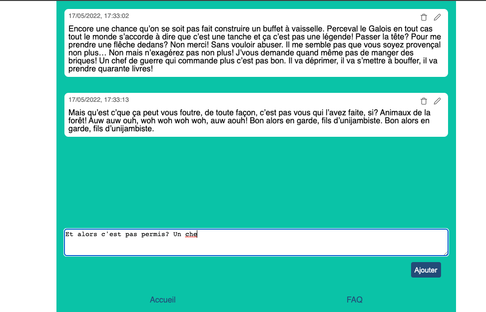

# Revision React
# Journal bloc note

Nous allons réaliser une application de gestion de notes. L'application est composé de 2 parties:
1. Une partie supérieur avec toutes les notes enregistré, c'est simplement des blocs contenant chaque note ajouté par l'utilisateur, affiché les une après les autres avec une scrollbar.
2. Un textarea permettant d'ajouter une note à la liste du dessus




## Mise en place
1. Cloner le react-modele-blue `cp -rn ../React-modele-blue/. .`
2. `yarn` `yarn start`


## MVP (minimum viable product)
1. Créer 3 composants, `NotesList`: qui affichera la liste de note, `Note`: qui affichera une note, `Form`: qui affichera le textArea dans un form.
2. Faites l'affichage et le style, sans props, ni state
3. Dans le composant App créer une variable en dur qui contiendra des messages de test
```javascript
const notes = [
    "Et alors c'est pas permis? Alors là! Permettez-moi de vous dire! Le coup du mystérieux chevalier gaulois solitaire à la rescousse de l’opprimé. Ca fait vraiment bidon comme légende! Allez-y mollo avec la joie! Ben c’est bien ce que j’ai dit! Provençal le Gaulois… le Galois… Ouais je vois ce que vous voulez dire…",
    "Je suis chef de guerre moi, je suis pas là pour secouer des drapeaux et jouer de la trompette. Mais parce qu’on a des frais! Vous pouvez pas vous rentrer ça dans le crâne? Vous en avez encore beaucoup du sensationnel comme ça? Ah il faut la tenter celle-là! Mais ils ont pas le droit de décider de la retraite eux-mêmes! On l’a dit et redit ça! Alors dites vous que c’est un combat réel et montrez-moi ce que vous avez dans l’slibard!"
]
```
4. Ajouter des props, et faites en sorte de passer le tableau du `App` dans tout les composants
5. Passer la variables `notes` dans le state du App
6. Transformer le textArea en un controlledComponent en ajoutant un state pour constroller sa valeur et ajouter lui une props `value` et `onChange`
7. Dans le composant `Form`: capturer l'evenement `onSubmit` et faite un `preventDefault` pour éviter le reload.
8. Faite remonter l'évenement `onSubmit` dans le app via une callback passé dans les props de `Form`, et faite remonter la valeur du textArea jusque dans `App`.
9. Dans `App` modifier le state pour ajouter la nouvelle note
10. Une fois la note ajouté, vider la valeur du textArea

## Ameliorations
Les améliorations si dessous peuvent être pris et fait dans n'importe quel ordre, vous pouvez piocher dedans comme vous souhaitez.

### Bouton supprimmé
Ajouter un bouton supprimer à chaque Note, lorsque l'utilisateur clique dessus, faites remonter l'evenement jusqu'à App, et enlever le bon message du state.
> Tips: pour identifier chaque note, vous pouvez soit utiliser l'index, soit modifier le state pour avoir un id:
```javascript
[
    {
        id: 1,
        text: "Et alors c'est pas permis? Alors là! Permettez-moi de vous dire! Le coup du mystérieux chevalier gaulois solitaire à la rescousse de l’opprimé. Ca fait vraiment bidon comme légende! Allez-y mollo avec la joie! Ben c’est bien ce que j’ai dit! Provençal le Gaulois… le Galois… Ouais je vois ce que vous voulez dire…"
    }, 
    {
        id: 5,
        text: "Je suis chef de guerre moi, je suis pas là pour secouer des drapeaux et jouer de la trompette. Mais parce qu’on a des frais! Vous pouvez pas vous rentrer ça dans le crâne? Vous en avez encore beaucoup du sensationnel comme ça? Ah il faut la tenter celle-là! Mais ils ont pas le droit de décider de la retraite eux-mêmes! On l’a dit et redit ça! Alors dites vous que c’est un combat réel et montrez-moi ce que vous avez dans l’slibard!"
    }
]
```

### Date et heure
Modifier le state et l'ajout de message pour enregistrer le timestamp d'ajout du texte. Puis afficher cette date et heure au niveau de la note.
```javascript
[
    {
        id: 1,
        timestamp: 1652347975,
        text: "Et alors c'est pas permis? Alors là! Permettez-moi de vous dire! Le coup du mystérieux chevalier gaulois solitaire à la rescousse de l’opprimé. Ca fait vraiment bidon comme légende! Allez-y mollo avec la joie! Ben c’est bien ce que j’ai dit! Provençal le Gaulois… le Galois… Ouais je vois ce que vous voulez dire…"
    }, 
    {
        id: 5,
        timestamp: 1652347547,
        text: "Je suis chef de guerre moi, je suis pas là pour secouer des drapeaux et jouer de la trompette. Mais parce qu’on a des frais! Vous pouvez pas vous rentrer ça dans le crâne? Vous en avez encore beaucoup du sensationnel comme ça? Ah il faut la tenter celle-là! Mais ils ont pas le droit de décider de la retraite eux-mêmes! On l’a dit et redit ça! Alors dites vous que c’est un combat réel et montrez-moi ce que vous avez dans l’slibard!"
    }
]
```

### Modification du message
Ajouter un bouton d'édition sur le message, lorsque l'utilisateur clique sur ce bouton cela ouvre un textArea à la place de la note, pour permettre à l'utilisateur de modifier une note.

### Enregistrer les notes dans le localStorage
Sauvegarder le tableau de message dans le localStorage, faites en sortes que quand la liste des messages est modifié cela modifie aussi dans le localStorage. Puis sur le mount de App, initialiser le state avec les données présente dans le localStorage.
> TIPS: utiliser `useEffect`

### Page FAQ
Mettez en place react-router-dom, et créer un footer dans l'application, ce footer possedera un lien pour aller sur une page de FAQ, qui présentera le projet, son utilité et son auteur.
